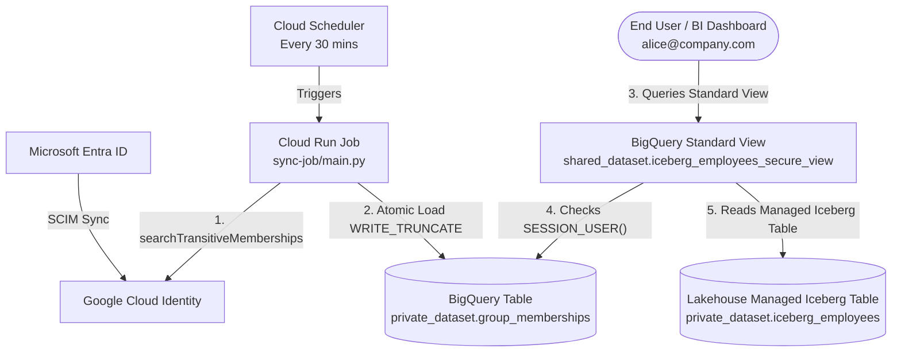

# BigQuery Lakehouse Managed Iceberg Tables: Dynamic CLS & RLS via Views & Group Sync

A lightweight, small-scale pattern for applying dynamic Column-Level Security (CLS) and Row-Level Security (RLS) masking/filtering on **Lakehouse runtime-managed Apache Iceberg tables** in Google Cloud BigQuery using **Standard SQL Views** and an automated **Cloud Identity / Entra ID group membership sync pipeline**.

---

## Context & Architectural Scope

**Lakehouse runtime-managed Apache Iceberg tables** in BigQuery have specific platform characteristics and limitations:
1. **No BigLake Cloud Resource Connection Required**: Lakehouse Managed Iceberg tables are managed directly by the Lakehouse runtime without requiring a BigLake Cloud Resource Connection.
2. **Authorized Views & Native RLS Are Not Supported**: Lakehouse runtime-managed Iceberg tables **do not support BigQuery Authorized Views** or native **Row-Level Security (RLS)** policies.

### Scope of This Solution
Because Authorized Views and native RLS policies are not supported on Lakehouse runtime-managed Iceberg tables, **this repository does not provide a full-fledged, zero-trust RLS/CLS enforcement boundary**. In BigQuery, querying a standard view requires the user to also hold `roles/bigquery.dataViewer` on the underlying tables—meaning a user with direct ad-hoc SQL access could query the base table if they know its identifier.

Instead, this solution demonstrates a **practical, small-scale implementation pattern** for dynamic group-based masking and row filtering where:
- Users consume data through curated **Standard Views** (e.g., via BI tools like Looker, semantic layers, or controlled reporting datasets).
- Transitive group memberships from **Google Cloud Identity / Microsoft Entra ID** are synced into a BigQuery lookup table (`group_memberships`) and evaluated dynamically at query time using `SESSION_USER()`.



### Key Architectural Highlights
1. **Lakehouse Managed Iceberg Tables (Connectionless)**: Operates directly on Lakehouse runtime-managed Iceberg tables without requiring a BigLake Cloud Resource Connection.
2. **Atomic Group Membership Sync**: A serverless Cloud Run Job runs on a schedule to flatten nested group memberships from Google Cloud Identity (or Entra ID) and overwrites `private_dataset.group_memberships` using `WRITE_TRUNCATE` (atomic transaction with zero query downtime).
3. **Zero-Fanout SQL Masking**: The standard view uses a 1-row CTE (`WITH user_permissions AS (...)`) combined with `CROSS JOIN` so that users belonging to multiple groups never cause duplicate rows or scan penalties on the Iceberg table.

---

## Repository Structure

```text
bq-iam-group-sync/
├── README.md
├── .gitignore
├── sync-job/
│   ├── main.py                        # Cloud Identity -> BigQuery group sync script
│   ├── requirements.txt               # Python dependencies
│   └── Dockerfile                     # Container definition for Cloud Run Job
└── sql/
    ├── 01_group_memberships_ddl.sql   # DDL for the group_memberships lookup table
    └── 02_iceberg_secure_view.sql     # Standard View with dynamic CLS/RLS via SESSION_USER()
```

---

## Step-by-Step Implementation Guide

Set your environment variables before running the commands below:
```bash
export PROJECT_ID="your-gcp-project-id"
export REGION="us-central1"
export BQ_LOCATION="US"
export PRIVATE_DATASET="private_dataset"
export SHARED_DATASET="shared_dataset"
export TARGET_GROUPS="hr-admins@company.com,finance-users@company.com"
```

### Step 1: Enable Required Google Cloud APIs
```bash
gcloud services enable \
  bigquery.googleapis.com \
  cloudidentity.googleapis.com \
  run.googleapis.com \
  cloudscheduler.googleapis.com \
  cloudbuild.googleapis.com \
  --project="${PROJECT_ID}"
```

---

### Step 2: Create BigQuery Datasets
Create the datasets for the base Iceberg table, group lookup table, and reporting views:

```bash
# 1. Create private_dataset (holds base Iceberg table + group_memberships lookup table)
bq --location="${BQ_LOCATION}" mk \
  --dataset \
  --description="Dataset containing Lakehouse Managed Iceberg tables and security lookup tables" \
  "${PROJECT_ID}:${PRIVATE_DATASET}"

# 2. Create shared_dataset (holds standard reporting views)
bq --location="${BQ_LOCATION}" mk \
  --dataset \
  --description="Dataset containing standard views with dynamic CLS/RLS masking" \
  "${PROJECT_ID}:${SHARED_DATASET}"
```

---

### Step 3: Create the Sync Service Account & Grant Permissions
Create the dedicated Service Account for the sync job and grant it permissions to load data into `private_dataset` and read Google Cloud Identity groups:

```bash
# 1. Create Service Account
gcloud iam service-accounts create bq-group-sync-sa \
  --display-name="BigQuery Group Membership Sync Service Account" \
  --project="${PROJECT_ID}"

export SYNC_SA_EMAIL="bq-group-sync-sa@${PROJECT_ID}.iam.gserviceaccount.com"

# 2. Grant BigQuery Job User at Project Level (required to run load jobs)
gcloud projects add-iam-policy-binding "${PROJECT_ID}" \
  --member="serviceAccount:${SYNC_SA_EMAIL}" \
  --role="roles/bigquery.jobUser"

# 3. Grant BigQuery Data Editor scoped strictly to private_dataset via SQL DCL
bq query --project_id="${PROJECT_ID}" --use_legacy_sql=false \
  "GRANT \`roles/bigquery.dataEditor\` ON SCHEMA \`${PROJECT_ID}.${PRIVATE_DATASET}\` TO 'serviceAccount:${SYNC_SA_EMAIL}';"
```

**Grant Cloud Identity Groups Reader Role in Google Admin Console:**
1. Open the [Google Admin Console](https://admin.google.com) (**Account** > **Admin roles**).
2. Select the **Groups Reader** role.
3. Click **Assign service accounts** and add `${SYNC_SA_EMAIL}`.

---

### Step 4: Deploy the Cloud Run Job & Cloud Scheduler Trigger
Deploy the serverless sync job directly from source (`./sync-job`) and schedule it to run every 30 minutes:

```bash
# 1. Build and deploy the Cloud Run Job from source
gcloud run jobs deploy cloud-identity-bq-sync \
  --source ./sync-job \
  --region "${REGION}" \
  --project "${PROJECT_ID}" \
  --service-account="${SYNC_SA_EMAIL}" \
  --set-env-vars="BQ_TABLE_ID=${PROJECT_ID}.${PRIVATE_DATASET}.group_memberships,TARGET_GROUPS=${TARGET_GROUPS}"

# 2. Grant the Service Account permission to invoke the Cloud Run Job
gcloud run jobs add-iam-policy-binding cloud-identity-bq-sync \
  --region "${REGION}" \
  --project "${PROJECT_ID}" \
  --member="serviceAccount:${SYNC_SA_EMAIL}" \
  --role="roles/run.invoker"

# 3. Create the Cloud Scheduler job to trigger the sync every 30 minutes
gcloud scheduler jobs create http trigger-cloud-identity-bq-sync \
  --location "${REGION}" \
  --project "${PROJECT_ID}" \
  --schedule="*/30 * * * *" \
  --uri="https://${REGION}-run.googleapis.com/apis/run.googleapis.com/v1/namespaces/${PROJECT_ID}/jobs/cloud-identity-bq-sync:run" \
  --http-method="POST" \
  --oauth-service-account-email="${SYNC_SA_EMAIL}"
```

---

### Step 5: Create the Lookup Table & Standard View
Update the project/dataset references in `sql/01_group_memberships_ddl.sql` and `sql/02_iceberg_secure_view.sql` (or replace `my-project` with `${PROJECT_ID}`), then execute the SQL scripts:

1. **Create the Group Membership Table** (`sql/01_group_memberships_ddl.sql`):
   ```bash
   sed "s/my-project/${PROJECT_ID}/g" sql/01_group_memberships_ddl.sql | \
     bq query --project_id="${PROJECT_ID}" --use_legacy_sql=false
   ```
2. **Trigger an Initial Sync** to populate `private_dataset.group_memberships`:
   ```bash
   gcloud run jobs execute cloud-identity-bq-sync \
     --region "${REGION}" \
     --project "${PROJECT_ID}" \
     --wait
   ```
3. **Create the Standard View** (`sql/02_iceberg_secure_view.sql`):
   ```bash
   sed "s/my-project/${PROJECT_ID}/g" sql/02_iceberg_secure_view.sql | \
     bq query --project_id="${PROJECT_ID}" --use_legacy_sql=false
   ```

---

### Step 6: Grant Dataset-Scoped User / BI Reader Access
Because Authorized Views are not supported on Lakehouse runtime-managed Iceberg tables, users (or BI service accounts) querying the standard view require `roles/bigquery.dataViewer` on both `shared_dataset` and `private_dataset`. Grant these dataset-scoped permissions using BigQuery SQL `GRANT`:

```bash
# 1. Grant Data Viewer on shared_dataset (for the view)
bq query --project_id="${PROJECT_ID}" --use_legacy_sql=false \
  "GRANT \`roles/bigquery.dataViewer\` ON SCHEMA \`${PROJECT_ID}.${SHARED_DATASET}\` TO 'group:analysts@company.com';"

# 2. Grant Data Viewer on private_dataset (required for standard view execution over Iceberg tables)
bq query --project_id="${PROJECT_ID}" --use_legacy_sql=false \
  "GRANT \`roles/bigquery.dataViewer\` ON SCHEMA \`${PROJECT_ID}.${PRIVATE_DATASET}\` TO 'group:analysts@company.com';"
```

> [!IMPORTANT]
> **Security Note for Small-Scale Deployments**: Because users hold `roles/bigquery.dataViewer` to satisfy BigQuery standard view execution requirements over Lakehouse Managed Iceberg tables, this pattern is best suited for **small-scale requirements, BI dashboards, or controlled query surfaces** where users interact with the curated view rather than executing arbitrary SQL against underlying tables.
